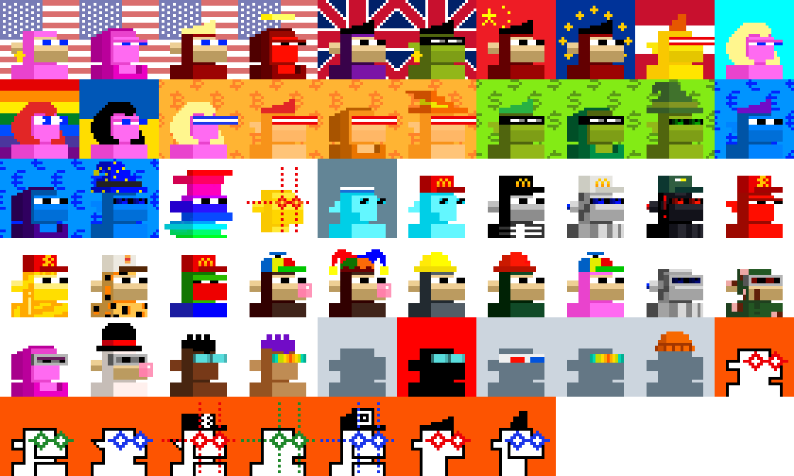

#  Monke See, Monke Do (28×28px)

Let's generate 21 000 monkes (28×28px) in a "Monke See, Monke Do" reference edition.

To be continued...

## Builders Corner - Yes, You Can

For reference find all (generative) attributes (base types, backgrounds and accessories) in 28×28px in [**/attributes**](attributes).

Yes, you can generate samples via "text prompts" using the generate_samples script.

In 4x:

## Questions? Comments?

Join us in the [Ordbase (Incl Ordgen / ORC-721) discord (chat server)](https://discord.gg/dDhvHKjm2t). Yes you can.
Your questions and commetary welcome.

Or post them over at the [Help & Support](https://github.com/geraldb/help) page. Thanks.

