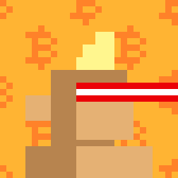

#  Monke See, Monke Do (28×28px)


Let's generate 21 000 monkes (28×28px) in a "Monke See, Monke Do" reference edition.


Find all 21 000 reference images one-by-one in 24×24px in [**/i**](i):


 


 ...

and in 8x (224×224px) in [**/i@8x**](i@8x):




 


 ...


Find all meta data in the [monkesee-monkedo.csv](monkesee-monkedo.csv) tabular dataset e.g.

```
id, type, accessories, background
0, light small, mohawk2 blonde / lasereyes red, bitcoin pattern
1, brown, tophat midnight, red
2, gray, hoodie red / eyes pepe, green
3, green, jesterhat, dollar pattern
4, pink small, bob blonde small / 3d glasses, blue
5, purple small, hoodie orange / 3d glasses, euro pattern
6, white, mohawk2 blonde / eyemask, aqua
7, alien, earring / eyes bot green, classic
8, boned, shades rainbow, rainbow
9, bot, cap burgerking / eyes bot green, ukraine
10, deathbot, wizardhat blue, usa
11, demon, eyes zombie, china
12, golden, beanie / shades polarized, great britain
13, hyena, hoodie aqua / eyes deathbot, europe
14, mempool, hoodie purple / shades polarized, austria
...
```


Bonus - All together now. Find the composite fam image of all 21 000 in a 200×105 grid in [monkesee-monkedo.png](monkesee-monkedo.png) (~4MB - 5600×2940px).


## Builders Corner - Yes, You Can

For reference find all (generative) attributes (base types, backgrounds and accessories) in 28×28px in [**/attributes**](attributes).

Yes, you can generate your own samples via "text prompts" using the generate_samples script
and you can regenerate this random set 
using the generate_meta script
and using the generate script to generate all images
from the tabular dataset.


## Questions? Comments?


Join us in the [Ordbase (Incl Ordgen / ORC-721) discord (chat server)](https://discord.gg/dDhvHKjm2t). Yes you can.
Your questions and commetary welcome.

Or post them over at the [Help & Support](https://github.com/geraldb/help) page. Thanks.

